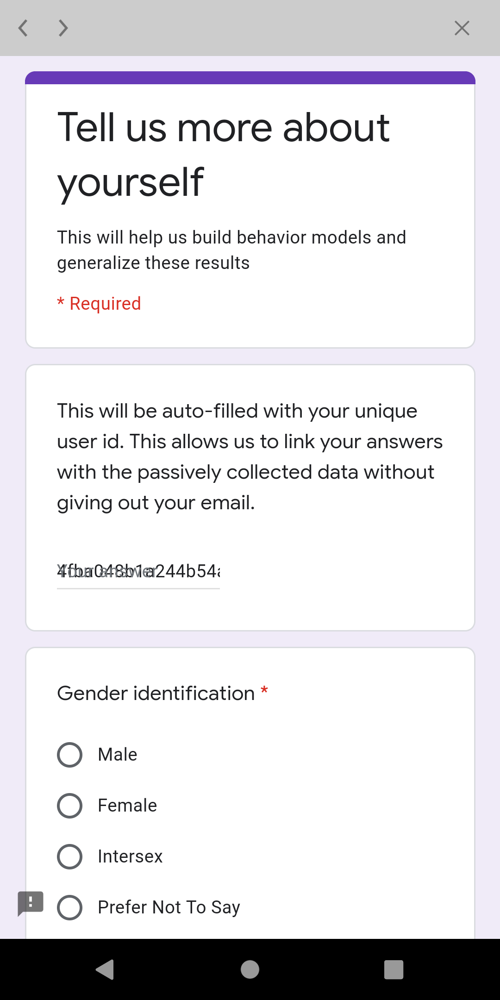
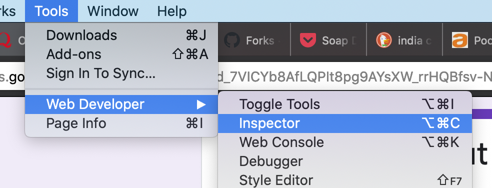
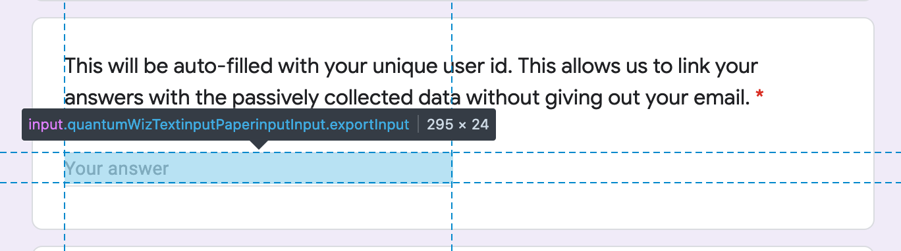
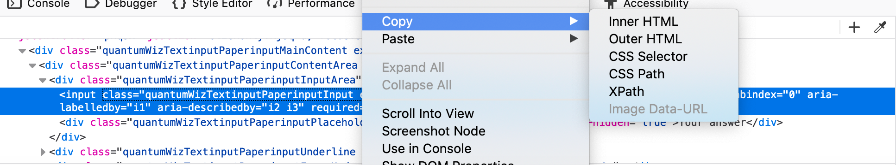
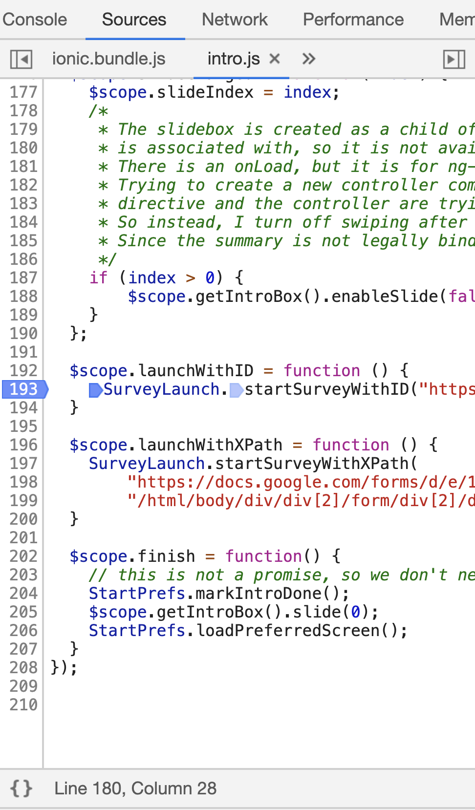
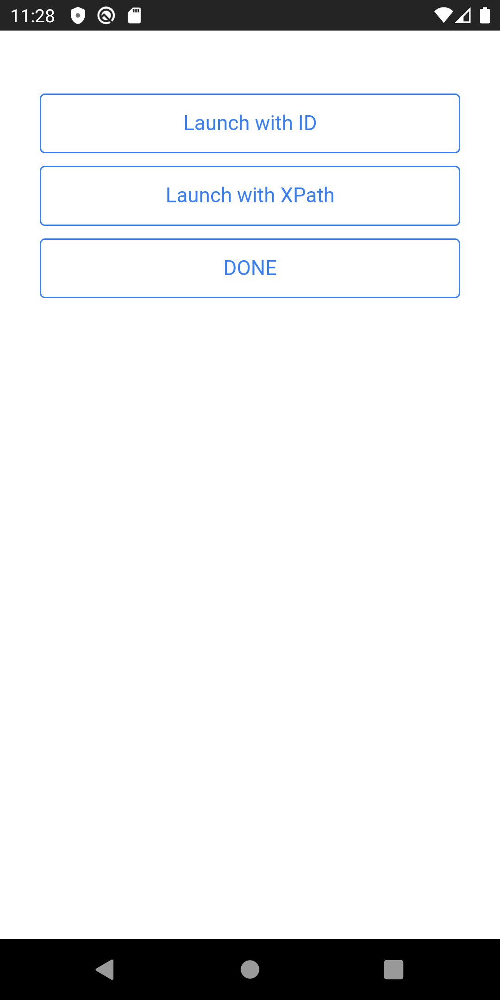

# How to embed an external survey in the app
---

The phone app supports embedding an external survey in the app. This survey is
launched in a separate window - the user can hit "Done" to return to the main
app at any time. Certain fields in the survey can be automatically filled out
by the app. This allows researchers to correlate the survey to any
automatically sensed data.

## Open source survey platform (potentially self-hosted)

The FabMob team have contributed an integration with LimeSurvey, which is an
open source survey framework. The survey server can potentially be self-hosted,
and you can add a survey tab that lists completed and pending surveys. Please see
[server limesurvey support](../../manage/adding_limesurvey_support.md) for more details.

## Generic, closed-source surveys (e.g. Qualtrics/Google Forms/Survey Monkey)

The app currently supports two kinds of auto-filled information. It has been
tested in qualtrics, but the basic idea should work for any survey platform
that identifies answer fields by ids. Note that this only gives the user a single
chance to answer the survey and does not allow them to see their answers or edit them later.

### Auto-fill UUID ###
The app can fill in the user's UUID into a field of the survey. This ensures
that sensitive information (such as email) is not leaked to the survey
platform, but the survey results can still be correlated with other data
collected.

e-mission currently supports uniquely identifying the field using its **id** or
the **XPath** to it. The **id** method is easier to use, but not all survey
tools support it. The **XPath** method should work for all survey tools.

| ID sample (qualtrics) | XPath sample (Google forms) |
|-------------- | ---------- |
|  |  |


#### Example of using element `id` ####

Here's an example qualtrics survey during construction and while in use. Note
that Q3 is automatically filled out by the app when the user launches the
survey. The auto-filled element MUST be in the first page of the survey.

This functionality is controlled by a survey spec, which specifies the URL to load the survey from, and the id of the element that needs to be filled out with the UUID.

The launch spec for the survey above is:

```
{
      "url": "https://berkeley.qualtrics.com/SE/?SID=SV_9t6KnGlK1qxOGGN",
      "uuidElementId": "QR~QID3"
}
```

The UUID element ID can be determined by opening the survey URL in a web
browser and inspecting the DOM. The steps for opening the DOM in several common browsers is:
- Firefox: Tools -> Web Developer -> Inspector,
- Safari: Develop -> Show Web Inspector (may need to enable developer menu),
- Chrome: View -> Developer -> Developer Tools.

The DOM element in the browser looks like this. Note that the `<input>` tag has
`id="QR~QID3` that is the id that needs to be put into the spec.

```
<div class="Inner BorderColor SL"gcdiv class="InnerInner BorderColor">
<fieldset>
<h2 class="noStyle"><label for="QR~QID3" class="QuestionText BorderColor">This will be auto-filled with your unique user id. This allows us to link your answers with the passively collected data without giving out your email to qualtrics.</label></h2><div class="QuestionBody">
<div class="ChoiceStructure">
<input autocomplete="off" id="QR~QID3" value="hello" class="InputText QR-QID3 QWatchTimer" name="QR~QID3~TEXT" data-runtime-textvalue="runtime.Value" type="TEXT">
</div></div>
</fieldset>
</div>
</div>
```

Once the spec is ready, launch the survey (either on button click or on navigate) using:
https://github.com/e-mission/e-mission-phone/blob/ad0344286751f62de1cf515f599f9dd7dfce4614/www/js/goals.js#L897

e.g.


```
angular.module('...',[..., 'emission.survey.launch', ....]
.controller('..;.', function(..., SurveyLaunch, ...) {
    $scope.startSurvey = function () {
      // arguments are (URL, elementID)
      SurveyLaunch.startSurveyWithID('https://berkeley.qualtrics.com/SE/?SID=SV_9t6KnGlK1qxOGGN', 'QR~QID3');
    }
})
```

and in HTML

```
<button class="button button-icon ion-clipboard" ng-click="startSurvey()">Survey</button>
```

#### Example of using element `XPath` ####

XPaths specify a traversal through the HTML DOM to uniquely identify an
element.  Here's an example qualtrics survey during construction and while in
use. Note that the first question is automatically filled out by the app when
the user launches the survey. The auto-filled element MUST be in the first page
of the survey.

The launch spec for the survey above is:

```
{
 "url": "https://docs.google.com/forms/d/e/1FAIpQLSd_7VICYb8AfLQPIt8pg9AYsXW_rrHQBfsv-NSviO7Dgk7fyg/viewform",
 "uuidXPath": "/html/body/div/div[2]/form/div[2]/div/div[2]/div[1]/div/div/div[2]/div/div[1]/div/div[1]/input"
}
```

The UUID element ID can be determined by opening the survey URL in a web
browser and inspecting the DOM. The steps for opening the DOM in several common browsers is:
- Firefox: Tools -> Web Developer -> Inspector,
- Chrome: View -> Developer -> Developer Tools.



Select the input field by moving over the HTML DOM. Note that the input field
will have an `<input>` tag.



Right click on the element tag in the inspector, and copy the xpath. Paste it
to the spec and you are done!



Once the spec is ready, launch the survey (either on button click or on navigate) using:

```
angular.module('...',[..., 'emission.survey.launch', ....]
.controller('..;.', function(..., SurveyLaunch, ...) {
    $scope.startSurvey = function () {
      // arguments are (URL, elementID)
      SurveyLaunch.startSurveyWithXPath(
        'https://docs.google.com/forms/d/e/1FAIpQLSd_7VICYb8AfLQPIt8pg9AYsXW_rrHQBfsv-NSviO7Dgk7fyg/viewform',
        '/html/body/div/div[2]/form/div[2]/div/div[2]/div[1]/div/div/div[2]/div/div[1]/div/div[1]/input');
    }
})
```

and in HTML

```
<button class="button button-icon ion-clipboard" ng-click="startSurvey()">Survey</button>
```

### Auto-fill UUID and trip information ###
The app can also fill in trip start and end timestamps and formatted times.
Note that although start and end locations are not leaked, start and end times
are, which means that this is not quite as privacy preserving as the previous approach.

In this case, your survey needs to have 5 special fields that you need to
obtain element IDs for (`uuid`, `start_ts`, `start_fmt_time`, `end_ts`,
`end_fmt_time`). Note that this method currently only supports **id** based
selection of all fields. We will add support for XPath on demand - please file
an issue, or consider submitting a PR directly!

Then, you launch the survey using

```
SurveyLaunch.startSurveyForCompletedTrip("https://berkeley.qualtrics.com/jfe/form/SV_80Sj1xdMHDrV4vX",
      "QR~QID12", "QR~QID13~1", "QR~QID13~2", "QR~QID13~3", "QR~QID13~4",
      start_ts, end_ts);

```

An example of a commit that implemented such a change is 
https://github.com/e-mission/e-mission-phone/commit/46eb53952d379808f994903dbd9a9d5a935b127a

### Testing external survey launches ###

If the survey is being launched from local javascript code, testing is pretty
easy. But if it designed to be launched from a remote push notification,
testing gets harder.
- push notifications don't work on iOS
- push notifications do work on android, but require a valid FCM client + server setup

Adding a simple screen to test notifications using the instructions below can
help with local testing before moving on to actual device testing. Remember to
revert the changes after the UX testing is done!

Download the new code (use "Save Link As.." to download the HTML correctly)

1. [Patch file (`test_external_surveys.patch`)](samples/test_external_surveys.patch)
1. [New screen (`test_survey.html`)](samples/test_survey.html)

Apply it

```
$ patch -p1 -i .../test_external_surveys.patch
$ cp .../test_survey.html www/templates/intro
```

Rebuild and rerun.

```
$ npx cordova emulate android
$ npx cordova emulate ios
```


The new screen post-login screen will launch surveys on demand. Edit the code
in `launch.js` to launch your survey instead.

| Launch survey sample code |  Launch survey UI |
|-------------- | ---------- |
|  |  |
