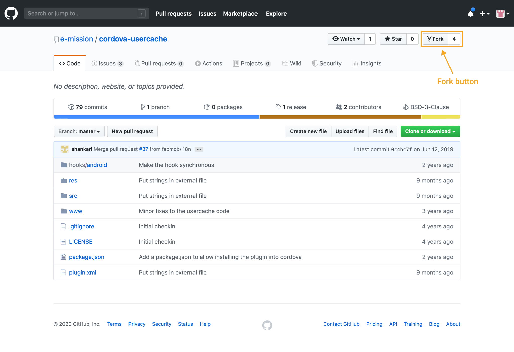
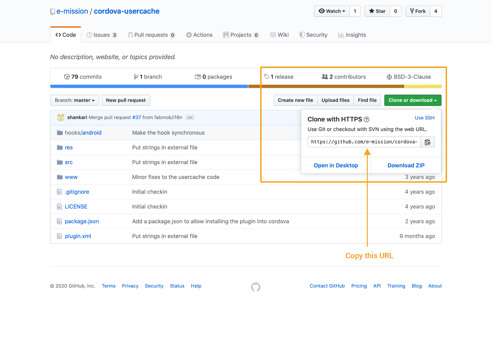

# How to test changes to a plugin locally

## Prerequisites
You should have Git installed on you local machine.

You will also need a local copy of the [e-mission-phone](https://github.com/e-mission/e-mission-phone) project. Follow these [instructions](https://github.com/e-mission/e-mission-phone/blob/master/README.md) to get a copy.

## 1. Fork the plugin repository
Go to the GitHub URL of the plugin you would like to test for example; ` https://github.com/e-mission/cordova-usercache` and click on the  **Fork** button.



**Fork** will create a copy of the repository in your Github account so you can make changes to the project.

## 2. Create a local copy on your computer
Navigate to your own Github copy of the repository and copy the url.



Open your terminal or git bash window.

Move to the location on your computer where you want to create a copy of the project.

For example;
```bash
$ cd ~/plugins
```
Run the following command:
```bash
$ git clone https://github.com/<username>/<repository>.git
```
> Substitute your Github username for `<username>` and the plugin repository name for `<repository>`.

You now have a local copy on your computer.

## 3. Add the local copy of your plugin to the e-mission phone project
First, open another terminal or git bash window and move to the location on your computer where you have your local `e-mission-phone` project.

For example:
```bash
$ cd ~/workshop/e-mission-phone
```

Next, remove the existing plugin
```bash
$ cordova plugin remove edu.berkeley.eecs.emission.<repository>
```

Then, add your local plugin to the `e-mission-phone`

```bash
$ cordova plugin add ~/plugins/<repository>
```
> Substitute the name of the repository for `<repository>`.

run `cordova prepare` to recompile the project.

> Any time you make changes to the plugin, remove it and re-add it to the e-mission-phone project.

<br/><br/>

# Quick and Easy development using the IDE
While the above approach helps test small changes, It is very time-consuming when it comes to complex ones. A faster way is to use an IDE for the appropriate platform. 

## 1. First, prepare and build your e-mission-phone project to generates all the required files.

```bash
# Copy files into platforms for building
$ cordova prepare

# Build the platform specific code
cordova build <platform>
```
> Replace the `<platform>` with either `ios` or `android`.

## 2. Then, open the project in your IDE.

### For Android development:

Launch Android Studio and select the Android platform directory in your project `(<project-location>/e-mission-phone/platforms/android)`.

Answer yes for the Gradle Sync question

Once it finishes importing, you should be able to build and run the app directly from Android Studio. See [Android Studio Overview](https://developer.android.com/studio/intro/index.html) and [Building and Running from Android Studio](https://developer.android.com/studio/run/index.html) for more details.

### For IOS development:
Launch Xcode and select the IOS platform directory in your project `(<project-location>/e-mission-phone/platforms/ios/emission.xcworkspace)`.

> Note: The last path (`/emission.xcworkspace`) is your app name appended to `.xcworkspace`. In our case, the app name is `emission`.

## 3. Finally, test your plugin using your IDE.

Make the necessary changes to the native code and test them in the IDE.

Then copy the code changes from the IDE back into your local plugin.
