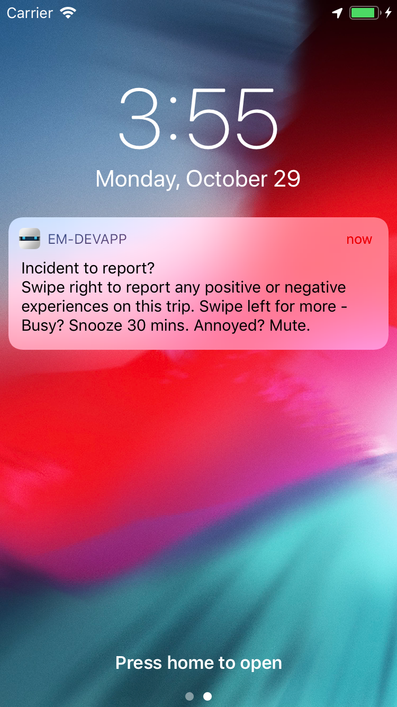
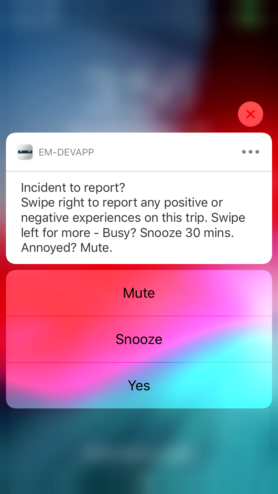
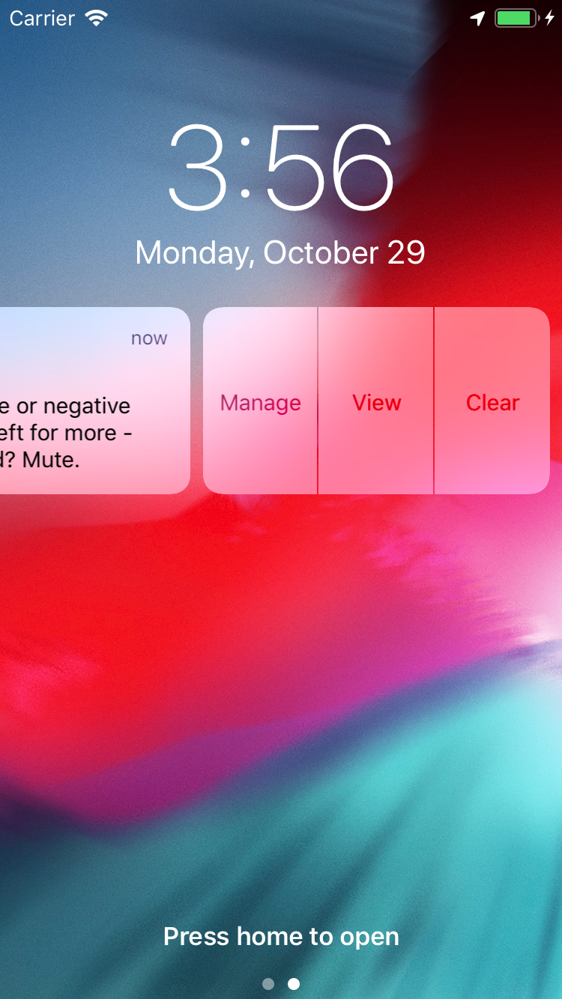

Change the trip-end prompt
---

e-mission supports generating notifications on the phone at various transitions of the trip state machine. These are currently:

- trip start
- trip end
- tracking off
- tracking on

The transitions are generated on the phone using the [transitionnotify](https://github.com/e-mission/e-mission-transition-notify.git) plugin. They do not need an internet connection or even a server to be running.

All the changes here assume that you have finished the install, and your installation satisfies *all* the success criteria.

### Registering for trip notifications ###

1. Open `www/js/incident/post-trip-prompt.js`
1. Check the last few lines of the file, and ensure that they say
    ```
    $ionicPlatform.ready().then(function() {
        ptap.registerTripEnd();
        ptap.registerUserResponse();
    });
    ```
    1. If the lines say `unregisterTripEnd` and `unregisterUserResponse` instead, change `unregister` -> `register`
    1. If there is no `$ionicPlatform.ready()` callback, add it as shown above
1. Save the file
1. The change is detected and the UI reloads.
1. Force-kill the app, reload and reconnect. The notifications are not registered properly otherwise.
    ```
    [phonegap] file changed /Users/shankari/e-mission/e-mission-phone/www/templates/intro/summary.html
    [phonegap] Running command: /Users/shankari/e-mission/e-mission-phone/hooks/after_prepare/010_add_platform_class.js /Users/shankari/e-mission/e-mission-phone
    ...
    [phonegap] [console.log] Ending config
    [phonegap] [console.log] Starting run
    [phonegap] [console.log] onLaunch method from factory called
    [phonegap] [console.log] Ending run
    ...
    [phonegap] [console.log] Running calorieData with 0 and 0
    [phonegap] [console.log] Running calculation with NaN and NaN
    [phonegap] 200 /__api__/autoreload?appID=39ec34dbbee54c9df1a13aa626c467ca
    ```

#### Testing ####
In order to test this, you need to start or end a trip. The most accurate option, and the one with the least setup, to install the app onto a physical device and take a trip. But it is hard to make changes to the prompts in that case. To test the notifications in an emulator:
  - Turn on locations
    - on android: Settings -> Location -> High Accuracy. Then open the location extended controls for the emulator and "send" a location to the emulator.
    - on iOS: Debug -> Location -> Freeway Drive 
  - Start/stop the trip
    - on both: (Developer Zone -> Start/Stop trip)
    - Extra things to note
      - the android emulator does not generate locations by default. You need to open the location extended controls and "send" a location. If you don't send the location, the app will remain stuck in the `start` state and you will never see any notifications. You can also upload a GPX or KML file for more realism.
      - iOS delivers all notifications to the app when it is in the foreground. so if you want to see a visual notification on iOS, connect safari debugger and put a breakpoint in `collect-settings.js` at line `cch.forceTransition(button.transition);`.  When it is hit, lock the emulator screen and resume execution. Now the notification will be visible. Alternatively, use android.

### Configuring notifications ###

Notifications are configured using the format from the [local notifications plugin](https://github.com/shankari/cordova-plugin-local-notifications.git). We use a fork that supports inline buttons. Note that in order to see the modified notifications in the devapp during development, you need to force kill and restart the app and re-download the UI.

#### Configuring notification text ####

1. Open `www/js/incident/post-trip-prompt.js`
1. Find the definition of the `reportNotifyConfig` e.g.
1. Change the title to `How much do you love this app`
1. Change the text to `This is super awesome`

    ```
    var reportNotifyConfig = {
      id: REPORT,
      title: "How much do you love this app?",
      text: "This is super awesome",
      icon: 'file://img/icon.png',
      smallIcon: 'res://ic_mood_question.png',
      sound: null,
      actions: actions,
      category: REPORT_INCIDENT_TEXT,
      autoClear: true
    };
    ```
    
1. Save the file
1. The change is detected and the UI reloads.
1. Force kill the app, restart and reconnect
1. Manually start/stop a trip from the developer zone
1. The notification now asks you whether the app is awesome, right?

#### Configuring notification actions ####

1. Find the button configurations
1. Change `MUTE` -> `5_STARS`
1. Change `SNOOZE` -> `MEH`
1. Change `REPORT` -> `SUCKS`
    e.g.
    ```
    var actions = [{
       identifier: '5_STARS',
       title: '5 Stars',
       icon: 'res://ic_moreoptions',
       activationMode: 'background',
       destructive: false,
       authenticationRequired: false
    }, {
       identifier: 'MEH',
       title: 'Meh',
       icon: 'res://ic_moreoptions',
       activationMode: 'background',
       destructive: false,
       authenticationRequired: false
    }, {
        identifier: 'SUCKS',
        title: 'Sucks',
        icon: 'res://ic_signin',
        activationMode: 'foreground',
        destructive: false,
        authenticationRequired: false
    }];
    ```
1. Change the checks for the buttons `if (data.identifier === 'REPORT')` -> `if (data.identifier === 'SUCKS')`
    e.g.
    ```
      if (data.identifier === 'SUCKS') {
        ...
      } else if (data.identifier == '5_STARS') {
        ...
      } else if (data.identifier === 'MEH') {
        ...
    ```
1. Add a `console.log` or `Logger.log` statement to each check - e.g.

    ```
          } else if (data.identifier == 'MEH') {
            Logger.log("User hit the meh button")
         ....
    ```

1. Note that the first two actions are background actions, so are intended to perform operations automatically without user interaction.
1. Save the file
1. The change is detected and the UI reloads.
1. Force kill the app, restart and reconnect
1. Manually start/stop a trip from the developer zone
1. Click on the notification buttons
1. Check the console logs and verify that the correct functions are invoked (e.g. if you clicked on `MEH`, you see `User hit the meh button`.

| Default prompt (iOS) | Default prompt (android) | New prompt (iOS) | New prompt (android |
| ------------- | --------- | ------------ | ----------- |
|  |  |  |  | 
|  | |  | | 
|  | | | | 
