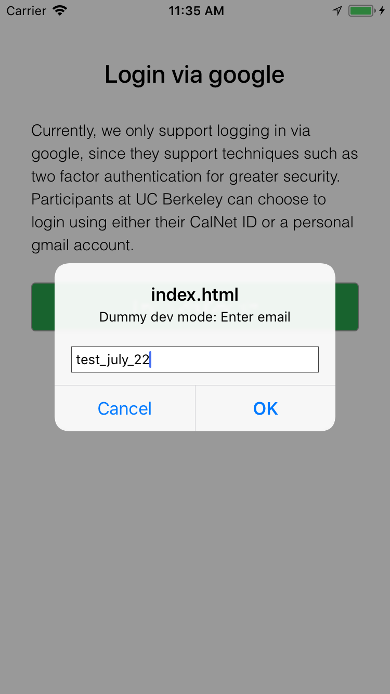
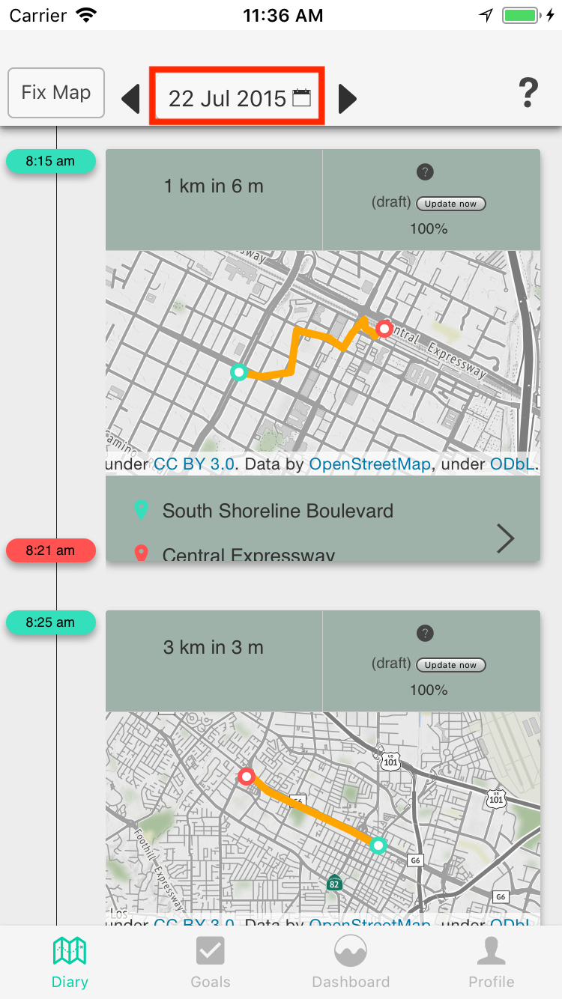

7 steps to an end-to-end development environment for UI-only changes
---

1. Install the server, including all [dependencies](https://github.com/e-mission/e-mission-server#dependencies) and the [e-mission code](https://github.com/e-mission/e-mission-server#installupdate)
1. Set up the devapp, by [downloading it](https://github.com/e-mission/e-mission-devapp#download) and [installing it in an emulator](https://github.com/e-mission/e-mission-devapp#installing)
1. Install the UI, including all [dependencies](https://github.com/e-mission/e-mission-phone#dependencies) and the [e-mission code](https://github.com/e-mission/e-mission-phone#installation)
1. [Start the server components](https://github.com/e-mission/e-mission-server#development), including mongod and the e-mission-server.
1. Load [sample data for a test user](https://github.com/e-mission/e-mission-server#quick-start). At the end of this step, you should be able to see this user in your local database. The server is now able to respond to API requests for this user.

    ```
    (emission) e-mission-server $ ./e-mission-ipy.bash
    Python 3.6.1 | packaged by conda-forge | (default, May 11 2017, 18:00:28)
    Type "copyright", "credits" or "license" for more information.

    IPython 5.3.0 -- An enhanced Interactive Python.
    ...
    
    In [1]: import emission.core.get_database as edb
    storage not configured, falling back to sample, default configuration
    Connecting to database URL localhost

    In [2]: list(edb.get_uuid_db().find())
    Out[2]:
    [{'_id': ObjectId('5b04d8582e26642a3d58d21e'),
    'update_ts': datetime.datetime(2018, 5, 22, 19, 56, 24, 9000),
    'user_email': 'test_july_22',
    'uuid': UUID('908eb622-be3f-4cf4-bf04-1b7e610bea1c')}]
    ```
    
1. Start the [UI development server](https://github.com/e-mission/e-mission-phone#running) and connect the devapp to it. The devapp will go through the "Downloading" and "Extracting" stages and then load the main e-mission UI.
1. Go through the e-mission onboarding process. When prompted for "dummy-dev auth", use `test_july_22`.
    - On android, you should not get any errors during the onboarding.
    - On iOS, you should get exactly one error saying that push notifications are not supported in the emulator
After the onboarding is complete, you can load data for July 22 **2015** from the diary tab.

#### Success checks ####

| Login screen | Expected error (only on iOS) | Diary for 22 July |  
|--------------|-------------------------------------|-------------------|
|  |  |  | 

##### Server logs #####

```
START 2018-05-23 11:35:40.056231 POST /profile/create
END 2018-05-23 11:35:40.115472 POST /profile/create  0.056568145751953125
START 2018-05-23 11:35:40.535397 POST /result/metrics/timestamp
END 2018-05-23 11:35:40.569467 POST /result/metrics/timestamp 908eb622-be3f-4cf4-bf04-1b7e610bea1c 0.03396773338317871
```

##### UI logs #####

```
[phonegap] [console.log] Consented in local storage, no need to show consent
[phonegap] [console.log] DEBUG:changing state to root.main.metrics
[phonegap] [console.log] loading root.main.metrics
[phonegap] [console.log] Sending data {"freq":"D","start_time":1525824000,"end_time":1526947200,"metric":""}
...
[phonegap] [console.log] twoWeeksAgoDuration =
[phonegap] [console.log] twoWeeksAgoMedianSpeed =
[phonegap] [console.log] twoWeeksAgoDistance =
[phonegap] [console.log] Running calorieData with 0 and 0
[phonegap] [console.log] Running calculation with NaN and NaN
```

#### Congratulations, you have now successfully set up the phone and server and connected them to each other ####
