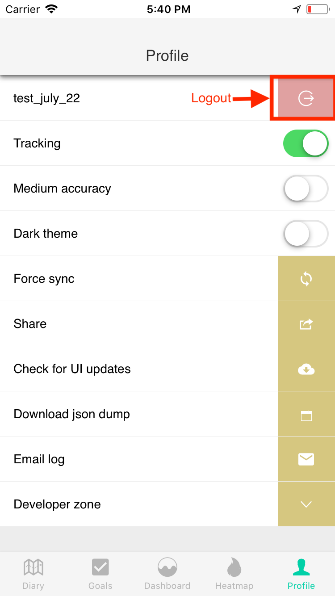

Change summary and consent
---

All e-mission projects so far have wanted to change the summary and consent to reflect their use of the platform. The summary and consent are part of the onboarding module. The HTML for the module is at `www/templates/intro` and the corresponding javascript is at `www/js`. Summary and consent changes replace the displayed text, and are HTML-only changes.

All the changes here assume that you have finished the install, and your installation satisfies *all* the success criteria.

### Summary changes ###

1. Open `www/templates/intro/summary.html`
1. Change `E-Mission: Data driven carbon emission reduction` to `My Cool App: Get suggestions on your commute`
1. Save the file
1. The change is detected and the UI reloads.
    ```
    [phonegap] file changed /Users/shankari/e-mission/e-mission-phone/www/templates/intro/summary.html
    [phonegap] Running command: /Users/shankari/e-mission/e-mission-phone/hooks/after_prepare/010_add_platform_class.js /Users/shankari/e-mission/e-mission-phone
    ...
    [phonegap] [console.log] Ending config
    [phonegap] [console.log] Starting run
    [phonegap] [console.log] onLaunch method from factory called
    [phonegap] [console.log] Ending run
    ...
    [phonegap] [console.log] Running calorieData with 0 and 0
    [phonegap] [console.log] Running calculation with NaN and NaN
    [phonegap] 200 /__api__/autoreload?appID=39ec34dbbee54c9df1a13aa626c467ca
    ```
1. Log out (Profile -> Email) to restart the onboarding process
1. The summary title is now `My Cool App`

### Consent changes ###

1. Open `www/templates/intro/consent.html`
1. Change `E-Mission: Data driven carbon emission reduction` to `My Cool App: Get suggestions on your commute`
1. Change
    ```
    This app is part of a travel behavior research platform developed at the
    University of California, Berkeley. The platform development is being led by <a
    href="http://www.cs.berkeley.edu/~shankari">K. Shankari</a> under the
    supervision of <a href="http://www.cs.berkeley.edu/~culler/">Prof. David
    Culler</a>. Our goal is to collect information from users about travel behavior
    across all modes, and use the aggregate information for better transportation
    infrastructure planning.
    ```
    to
    ```
    This app is part of a study conducted by my cool research institute in
    Terminus, First Foundation. The platform development is being led by 
    Arkady Darrell under the supervision of Prof. Susan Calvin. Our goal
    is to see if robotic scheduling can mitigate the unsustainable travel
    behavior of the citizens of Trantor, in the presence of mind control by the
    inhabitants of the Second Foundation.
    ```
1. Save the file
1. The change is detected and the UI reloads.
1. Log out (Profile -> Email) to restart the onboarding process
1. The consent page is now for the Trantor travel study.

| How to logout | New title (my cool app) | New consent (trantor study) |
| ------------- | --------- | ------------ |
|  |  |  |
