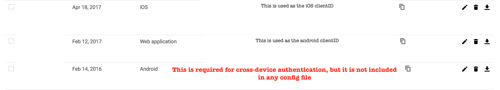
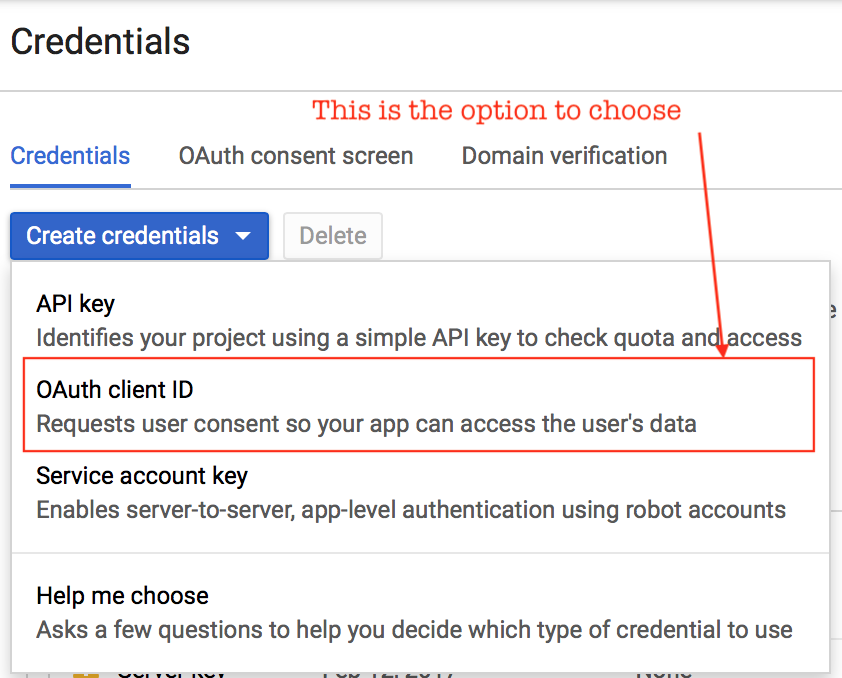
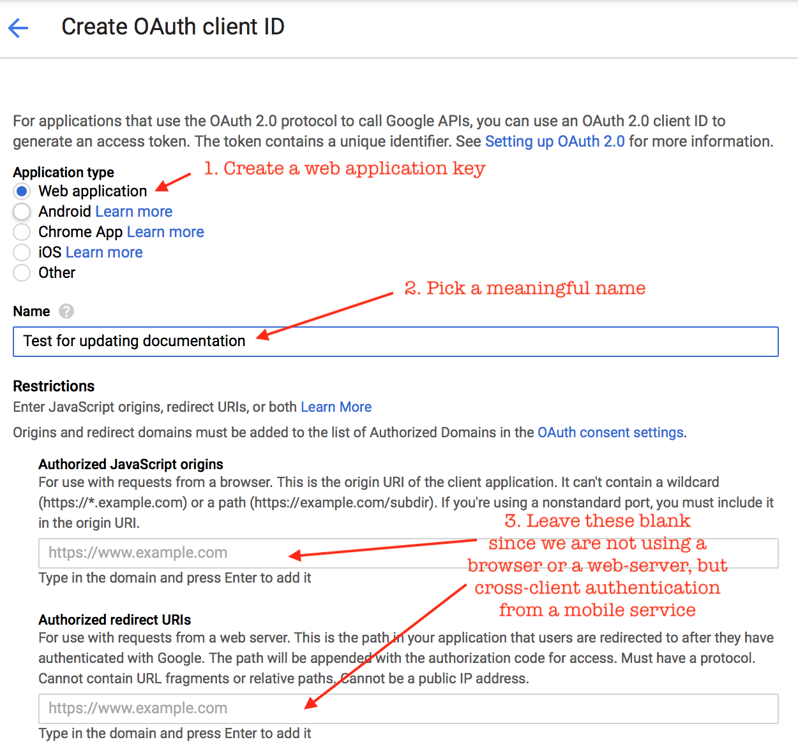

# Configuring Authentication
---

The end to end system now supports multiple auth methods.
On the server, the auth method is specified in the `webserver.conf` file - e.g. `"auth": "skip"`. Further configuration of the specified auth method is in the `conf/net/auth/<auth_method>.json` file.

```
  "server" : {
    "host" : "localhost",
    "port" : "8080",
    "__comment": "1 hour = 60 min = 60 * 60 sec",
    "timeout" : "3600",
    "auth": "skip"
  },
```

On the client, the auth method is specified in `www/json/connectionConfig.json`. You can find sample files for connecting physical devices to the local server (`www/json/connectionConfig.physical_device2localhost.json.sample`), for connecting to production servers using a variety of authentication methods (e.g. `www/json/connectionConfig.googleauth.json.sample`).

The currently supported auth methods and their configurations are described below.

### `skip`/`prompted-auth` ###

This is the default, and is intended to make the development process easier.  It requires no additional configuration, because it does no verification. It simply assumes that the incoming token is the "email address" and all email addresses are valid.

Anybody who knows the incoming email address/token/identifier can access the user's data.  If this identifier is well known, like an email address or phone number, this option is horribly insecure. If this identifier is secret, like a password or a token from a list, then it is somewhat secure. However, it is a very unsophisticated method - it does not enforce strong passwords, or support password recovery, 2 factor authentication or security questions. If your user loses their password, their password is compromised, or they want to switch their phone, all their data is lost.

### `token_list`/`prompted-auth` ###

This method is designed for short, controlled studies with extensive participant interaction. A list of pre-created _tokens_ (essentially pre-recreated passwords) is stored on the server, and participants are handed tokens in person as they are recruited. The incoming token is checked against the pre-created list - if it exists, it is valid, if not, it is not.

This is similar to the `skip` method because the user enters the token directly into the app. The only difference is that the `skip` method does not validate the token in any way - users can freely create new tokens, while the `token_list` enforces that the token is from the configured list.

#### Configuration ####

The only parameter is the path to the file with the list of pre-created tokens - e.g. in `conf/net/auth/token_list.json` 

```
{
  "token_list": "conf/net/token_list",
}
```

where `conf/net/token_list` is something like (from https://github.com/redacted/XKCD-password-generator)

```
correct_horse_battery_staple
collar_highly_asset_ovoid_sultan
caper_hangup_addle_oboist_scroll
couple_honcho_abbot_obtain_simple
```

#### Generating a token list ####
Generating a large, valid token list is important to ensure security. For users who are not comfortable with scripting, random.org's password generator is a good option. To use it:

1. Go to https://www.random.org/passwords/
1. Switch to advanced mode
1. *IMPORTANT* Select "bare-bones text document" output
1. Copy and paste the generated passwords into a text editor.
   - Built-in text editors are: Notepad on windows and vi/vim on \*ix and OSX
   - You can also download text editors such as vim (https://vim.sourceforge.io/download.php#pc), Sublime Text (http://www.sublimetext.com/3) and Atom (https://atom.io/)
   - Do *NOT* use document editors such as microsoft word - they might add additional formatting that will mess up the token matching.
1. Save as plain text

The token file should be readable with the following script.

```
$ python
In [1]: raw_token_list = open("conf/net/token_list").readlines()

In [2]: token_list = [t.strip() for t in raw_token_list]

In [3]: print token_list
```

### `openid_auth`/`openid-authutil` ###

If you want to use a more full-featured authentication server, you could consider integrating with an [OpenID]() server. This will generate JWTs, short lived tokens that are refreshed when needed, and depending on the server, support a rich set of features. To configure the **server** for OpenID, see `conf/net/auth/openid_auth.json.sample`. To configure the **phone** for OpenID, see `www/json/connectionConfig.openid.json.sample`, and the [associated README](https://github.com/e-mission/cordova-jwt-auth/blob/master/README.openid.md)

### `google_auth`/`google-authutil` ###

This option uses JWTs using the google identity solution with [cross-client authentication](https://developers.google.com/identity/protocols/CrossClientAuth#accessTokens). The JWTs are decrypted using google's public keys and decoded using the `google-auth` library.

- If you are deploying a new UI on the existing e-mission app, you need to ask me to generate google client keys.
- If you are deploying your own app, register your app in the google developer console and generate your own client keys.

#### Configuration ####

- create `android`, `ios` and `web application` credentials in the same project at https://console.developers.google.com
- use the `web application` key for android
- use the `ios` key for iOS, but encoded into the native app as a URL type
- the `android` key is not used directly, but is required to be in the project to allow the android authentication to proceed



If you have just created a set of keys, you can just duplicate them to make the old and new keys - e.g. in `conf/net/auth/google_auth.json`


```
  "client_key_old" : "11111111111-aaaaaaaaaaaaaaaa.apps.googleusercontent.com",
  "client_key" : "11111111111-aaaaaaaaaaaaaaaa.apps.googleusercontent.com",
  "__comment": "iOS client key to handle the fact that the google iOS API does not work. The open source API does not take the webclient app, so we have the iOS client ID here.",
  "ios_client_key" : "11111111111-iiiiiiiiiiiiiiii.apps.googleusercontent.com",
  "ios_client_key_new" : "11111111111-iiiiiiiiiiiiiiii.apps.googleusercontent.com",
```

#### More details/FAQ ####

1. **Q:** Can I use google auth with the devapp in order to test my development changes end to end?
   
  **A:** Yes! But you still need to get tokens from me because the native app needs to have the right keystore/client ID configured in the URL schemes.
1. **Q:** How do I get the tokens from you? 

  **A:** Send me your GPG public key, including [create](https://www.gnupg.org/gph/en/manual/c14.html) and[ exporting ](https://www.gnupg.org/gph/en/manual/x56.html)if needed. I will send you an encrypted client `connectionConfig.json` file. You can copy the values from the client file to the server file.
1. When generating my own tokens:
    1. **Q:** For android, do we use `webapp` or `android` as application type? 

        **A:** `Web application`. You need to use the same web application clientID in both the client json and the server json. And unless you are planning to roll your own native app, you need to get the keys from me. Otherwise, the keystore that is configured for the project will be incorrect, and the auth won't work.

    1. **Q:** How do I configure the `webapp`? Do I have to add a redirect URL?

        **A:** See screenshots below. You do not need to add any restrictions since we are not really using a browser for authentication. We are using cross-client authentication using native code in a mobile app.
        
        | Selection | Configuration | Success |
        | --------  | ------------- | --------|
        |  |  |  |

    1. **Q:** For ios, do we use `webapp` or `ios`  as application type? 

        **A:** `iOS`. Again, you need to use the same ID in both the client json and the server json. And unless you are planning to roll your own native app, you need to get the keys from me. Otherwise, the URL scheme(s) that are configured for in the app will be incorrect, and the auth won't work.
    1. **Q:** By “client_key”, do you mean `clientID` or `clientSecret`? 

        **A:** `clientID`

