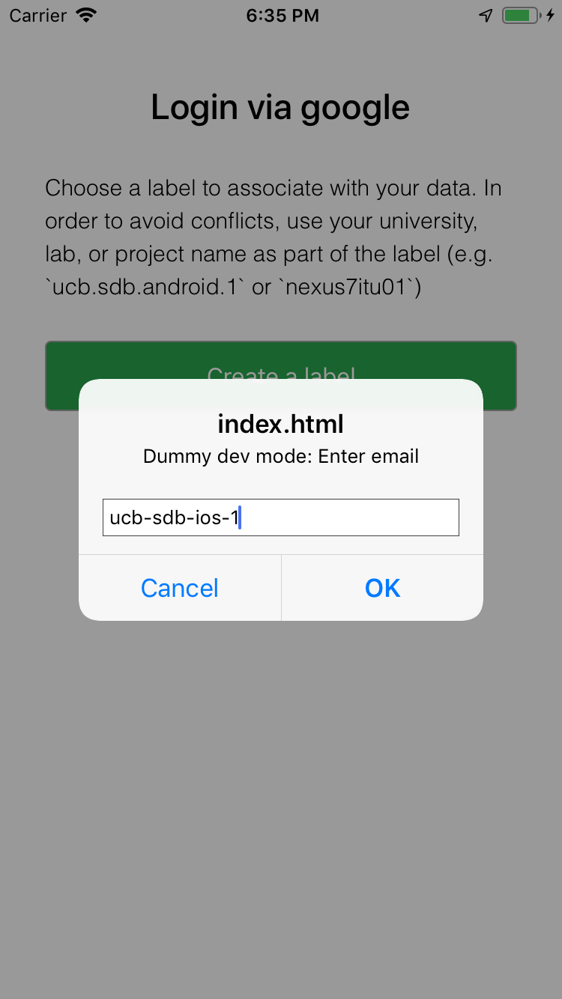
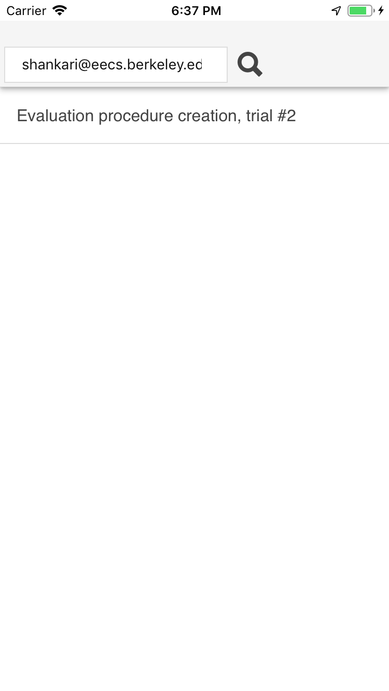
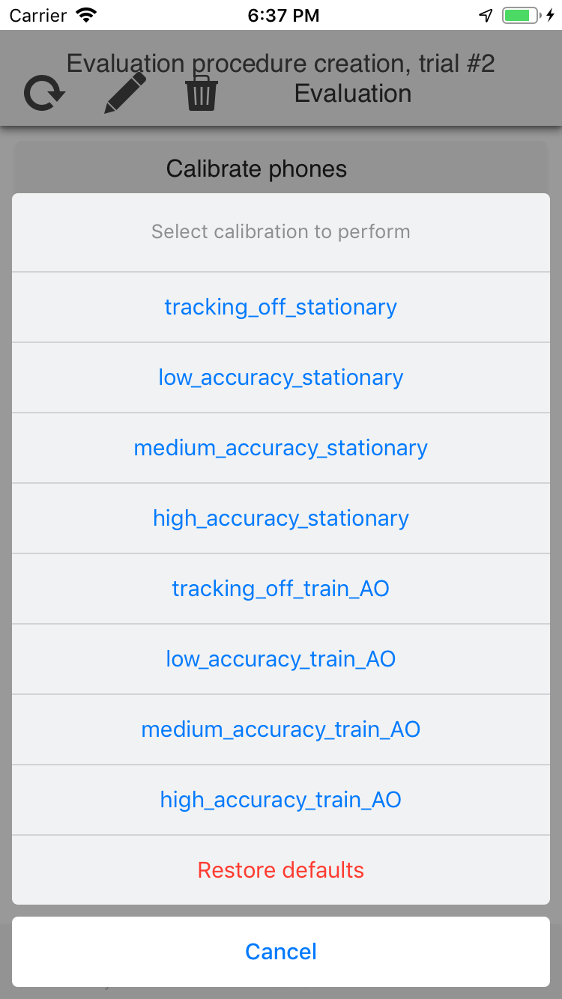
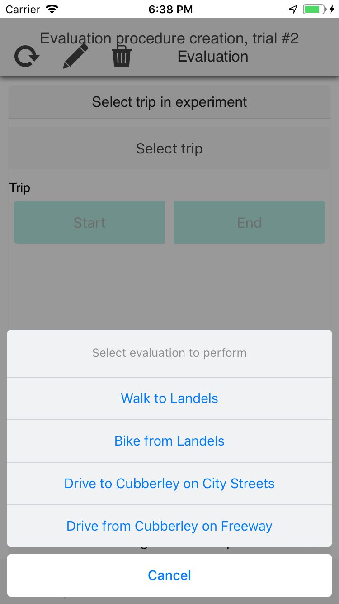

# Evaluate travel data collection 

This project outlines the tools to evaluate travel data collection using
smartphone apps. The two key components of this evaluation technique are:
- we use multiple identical phones to assess the power/accuracy tradeoffs
- we use pre-defined, artificial trips to address privacy and comparability

More details in the em-eval paper, currently available via request.

The high-level procedure to perform a new experiment with this method is as follows:
- create an evaluation spec that outlines the basic parameters of the experiment
- fill in the evaluation spec with queryable details and validate it
- upload the spec to a public datastore to establish a record
- install the evaluation app(s) on the test phones and configure them
- calibrate the phones to ensure that battery drain is consistent
- perform the evaluation
- publish the results, along with the related notebooks

There are two main limitations with the current version of the procedure:
- any testing of the phone in the active state (user interacts with while
  stationary) is currently manual. See
https://www2.eecs.berkeley.edu/Pubs/TechRpts/2016/EECS-2016-119.html for more
details
- the evaluation trips are currently unimodal and support only CAR, WALKING and
  BICYCLING. Attempts to experiment with autofilling public transit routes are
  documented in `coordinate_autofill_experiments`. The easiest option is to pay
  Google to use Google Maps, but I'm holding out for an open source option.

## Create an evaluation spec ##

An example evaluation spec is at `evaluation.spec.sample` and can be simply
copied over and edited as necessary. The various sections of the spe are:
- `id`, `name`, `region`, `*_fmt_date`: basic information about where and when
  the evaluation was conducted
- `phones`: the phone labels that will be used in the experiment and their
  roles. The control phones are used for comparison; the evaluation phones are
  used for the experiment. The `accuracy_control` phone will have a more
  complex UI that will allow the collection of ground truth.
- `calibration_tests`: indicates how the phones will be calibrated before the
  experiments start. The phones can be calibrated when stationary, moving, and
  with different accuracy and sensing frequencies.
- `sensing_settings`: the experiment settings to be compared. The length of
  this array can be no greater than the number of evaluation phones in the
  experiment. Since the experimental regimes in e-mission are configurable,
  these are typically regime keys that refer to the constants in
  `sensing_regimes.all.specs.json`. If one of the comparisons is to a closed
  source implementation that is not configurable, then this can be a generic
  string, and the app needs to be manually installed on the phone.
- `evaluation_trips`: the list of travel trips to be evaluated, along with a
  small set of waypoints that uniquely defines each route. Other locations
  along the route will be autofilled.
- `setup_notes`: details of how the evaluation phones were set up, and any
  differences or other things to note.

## fill in the evaluation spec with queryable details and validate it ##

The evaluation code is in the
https://github.com/e-mission/e-mission-eval-public-data repository.

```
$ git clone https://github.com/e-mission/e-mission-eval-public-data
$ python setup.sh
```

Autofill

```
$ python autofill_eval_spec.py evaluation.spec.sample evaluation.spec.filled.json
```

Start jupyter

```
$ jupyter notebook
```

Run the validation notebook (`Validate_spec_before_upload.ipynb`) and ensure
that the trips look fine

## upload the spec to a public datastore to establish a record ##

```
$ python upload_validated_spec.py <datastore_url> <evaluation_author_email> evaluation.spec.filled.json
```

- `datastore_url`: if using the emevalzephyr channel, this is currently http://cardshark.cs.berkeley.edu:8888 This is likely to change after the primary author @shankari graduates.
- `evaluation_author_email` is an arbitrary string. However, it is key to retrieving the related data so it would be good to make it memorable. The spec creator's public email address is probably a reasonable option for now.

## install the evaluation app(s) on the test phones and configure them ##

On each of the apps involved in the evaluation, follow the instructions at the [emevalzephyr installation page](https://e-mission.eecs.berkeley.edu/#/client_setup?new_client=emevalzephyr&clear_usercache=true&clear_local_storage=true) to install and configure the app

Configuration steps:

| At step               | Do action            | At step | Do action |
|-----------------------|----------------------|-------- |---------- |
|  | When prompted, login with phone labels defined in the evaluation spec (e.g. `ucb-sdb-android-1`/`ucb-sdb-ios-1`/...) |  | Select evaluation from the list for the `evaluation_ author_email` above |
|  | Select calibration or evaluation regime | | Select trip, start or end etc |

Note that as part of selecting the evaluation, the current phone is matched to its role/profile in the evaluation spec. So if the phone label changes, the selected spec needs to be deleted and re-selected.

## calibrate the phones to ensure that battery drain is consistent ##

1. Select the same calibration regime on all the phones
1. Check that the data is being collected properly by using the
`Validate_calibration` https://github.com/e-mission/e-mission-eval-public-data/blob/master/calibration_templates/Validate_calibration.ipynb notebook
1. If some of the phones do not have any transitions sent to the server yet,
use Profile -> Force Sync to force them to send the data and ensure that the
connection to the server is stable
1. At the end of a reasonable calibration period, restore defaults
1. Repeat the procedure for the other calibration regimes defined
1. Note that you can run the calibration notebook either locally, or using binder

## perform the evaluation ##

1. Select the experiment to run on the evaluation phones
1. On the `accuracy_control` phone, select the trip to perform. This will also
show you the route that you should take.
1. On the `accuracy_control` phone, start the trip. Since this is the
**accuracy** control, you can leave the screen on and use it to navigate
without worrying about the power drain.

## publish the results, along with the related notebooks ##

Check in the calibration and evaluation notebooks into a github repository and
link to it from the published results. The data remains in the public datastore
for others to reuse. Future researchers can reproduce your results by
re-running the notebooks.

## Enjoy and share! ##
