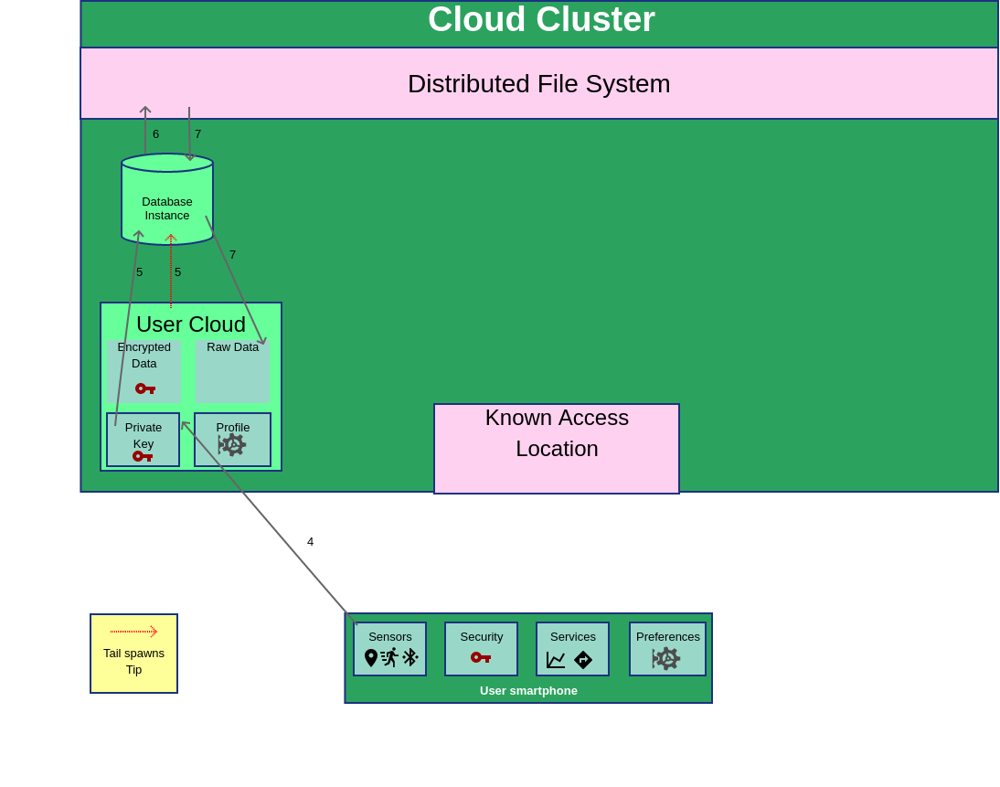

# Architecture Changes

The document contains a list of the proposed architecture changes to the e-mission platform to increase user control over data and privacy.

It is organized into the following sections:
  * Overview
  * Application Changes
  * Server Changes
  * Detailed Description
  * Remaining Challenges

## Overview

The plans to change the e-mission architecture are oriented around keeping user data encrypted and only decrypting the data when an approved service or algorithm needs to run on the data. The general workflow for maintaining detail is:
1. The user collects data from the application. This application uses a phone specific private key to encrypt the data and sends the encrypted data to the server.
2. The user finds an algorithm which they wish to run on their data or an aggregating algorithm in which they comfortable participating. The user then acquires the hash for this algorithm (possibly with a QR code) and updates their profile on the server to grant permissions to run the algorithm.
3. The user decides they want to run one of the algorithms they have approved. To do so they need to send their private key to the server so that it can decrypt their stored data. This is done by spawning a user enclave built through Graphene SGX running in a docker container. The user then remotely attests this container and once this establishes a secure between the user and enclave, the user transmits the private key over that channel.
4. The server enclave uses the hash for the algorithm to determine a microservice to run on the server (or remotely). This then spawns a microservice enclave, which the server enclave will need to attest to develop a secure channel.
5. The server enclave sends the data to the microservice to use in conducting its algorithm. In doing so, the server enclave will decrypt the data inside the secure enclave and then transmit the data over the secure channel formed between the enclaves.
6. The microservice performs the algorithm and returns to the server enclave the output of the algorithm.
7. The server enclave then returns to the user the result of running the algorithm.

A few of these steps can differ slightly depending on if an aggregation algorithm is being run or if a user is running an algorithm on their own data, but we will cover these details in their respective sections.

## Application Changes

The application will need to be modified in 3 key ways to allow secure data storage and algorithm approval. These are:

  * Adding a private key.
  * Adding a channel to upload private key information.
  * Adding a mechanism to allow, revoke, or perform an algorithm.

### Private Key

To allow for secure data storage each user will need a secret key with which to encrypt the data. The key should ideally be stored directly on their phone for safe storage and will need to be used throughout the data upload process. Then when the user needs to upload data to the server, the phone will first encrypt the data using a symmetric encryption algorithm with this private key.

### Upload Channel

The encrypted data can be transmitted along any channel because the key is pressumed secret. This fundamentally means the data is useless unless the system processing it has direct access to the private key. Since we seek avoid doing all computation at the user level we need to provide a means of providing a user's private key to the server. To do so we rely on secure enclaves (which we will focus on later) to be able to uniquely hold this information securely. In order to actually upload this information we need to associate each user's enclave with a unique certificate to validate through TLS. As a result it is necessary to equip the application with information about where to find the user's server enclave.

### Algorithm Permissions

To give users control over which algorithms can run it is necessary to both provide a user profile containing algorithms permissions and a means to update it. This profile needs to uniquely describe each algorithm and its contents, which is described by a hash over the algorithm contents. To update the profile a copy should be maintained locally which will then need to be uploaded to the server through the same upload channel as the private key. To make these hashes obtainable there should be some common source, possibly through a QR code for each algorithm that will upload them directly to the user's profile.

## Server Changes

To allow the changes on the application end to work as intended, there are also many changes that will need to made to the server deployment. These changes are:

  * Encrypted Storage
  * Secure Enclave Containers
  * User Profiles
  * Algorithm Microservices

### Encrypted Storage

Maintaining a user's data requires stores the encrypted information. This can either be done through an encrypted database or simply through files storing the relevant information for each user. We believe since files are the simplest that this all our initial approach warrants, especially since there can be possible limitations when reading timeseries data from an encrypted database. However should efficiency be an issue we will consider moving to an encrypted database. When opting to store data important decisions must also be made with respect to how to store each component as partitioning data risks leaking information about when it was collected.

### Secure Enclave Containers

To allow for decrypting user data we will launch secure enclaves built upon Intel SGX (in particular we will use the Graphene research project) on the server with docker. These enclaves represent the other end of the upload channel discussed earlier. Each enclave needs to be unique to a user and be accessible through a certificate both identifying the domain and the exact enclave. Then when the user wants to compute an algorithm on private data the user will upload their private key to the enclave, providing it the means to access the raw data. Since the enclave memory is protected from the rest of the system, this key will be securely protected from the rest of the server. Whenever needs to be processed it will always go through this server enclave. The data will be loaded into enclave memory encrypted, decrypted inside the enclave, and then sent to any processing enclave through a secure channel. The secure enclave will only communicate with the user directly and other enclaves that it trusts and has verified.

### User Profiles

To actually facilitate verifying these enclaves the user needs to specify what algorithms are permitted to be performed on user data. This is facilitated with the aforementioned profile of algorithm hashes. Crucially, this trusts the contents of any approved algorithm. This means that any algorithm a user approves should be vetted by the open source community and possibly reviewed by the user as well (although this may not be appropriate in many cases). To reduce the burden on particular users it may prove beneficial to directly describe a system for assisting users in analyzing algorithms for those who lack such expertise. Whenever changes are made the profile, it is necessary to reupload the contents in order to avoid relying on the older, outdated version.

### Algorithm Microservices

To actually conduct the algorithms we assume that each algorithm can be deployed in a secure enclave with Intel SGX, preferably with Graphene (although that may not be strictly necessary). There are two distinct types of algorithms:

  * User run algorithms.
  * Aggregate Algorithms.

#### User Run Algorithms

If a user wishes to run an algorithm they simply need to make a request to their server enclave. This will then tell the enclave to fetch and decrypt the necessary data to provide to the algorithm. It will then request that the server launch a new enclave for the appropriate algorithm. One that enclave is launched it will authenticate the identity of the enclave and develop a secure channel through which it will upload the user's data. Then one that enclave has completed processing, it will return the relevant results to the server enclave which will retransmit that data to the user (possibly after the user reconnects).

#### Aggregate Algorithms

It is also possible for a user to agree to be a participant in algorithms that aggregate over larger groups of data. This requires a few changes to the architecture and a different form of interaction. First to facility these algorithms that are not requested by the user it is necessary to have the server enclave available even when a user is offline. To do this we will keep the server enclave running with the private key and the user profile and only shut down the enclave upon request from the user or if it necessary to update details about the profile or key in a manner which modifies existing behavior. 
Since aggregation also occurs independent of user requests it is no longer feasible to have the server enclave launch a microservice. Instead the group intending to perform aggregation with launch an aggregator enclave which will launch a new enclave per user which produces a scalar value based upon the user's data. That scalar enclave will communicate directly with the server enclave to get the data and will need to be stored in the profile. Then this scalar can be directly communicated to the aggregator enclave to compute the aggregate result over the data.

## Detailed Description

In this section we will provide a detailed description of the steps necessary for the architecture to function. In particular we will be discussing:

  * Uploading Data
  * Performing a User Requested Algorithm
  * Participating in an Aggreagated Algorithm

This section is important because the steps will be very close to the actual implementation. If there is an issue that is clear from this section it suggests the new for at a minimum an implementation redesign and possibly architectural changes.

### Uploading Data

The following are the steps that are necessary to upload data to the server.

1. The user's smartphone makes a request to a known access location (essential a server at a known domain) with a request to spawn a user cloud instance.
2. The known access location spawns a container to produce a "user cloud." This user cloud consists of a server running inside a secure enclave via Graphene. The known access location then replies to the smartphone with an address and port of the spawned user cloud.
3. The smart phone connects to the known access location. The two establish a secure channel through SGX's remote attestation. All user cloud will run the same general program, so this component is trusted to only allow a new user to connect once at the beginning. While the known access location is untrusted the user cloud code's will be open source and its hash known, allowing us to verify the connection. Then the smartphone will send its private key and profile of allowed algorithm to the user cloud.
4. The user sends some data to the user cloud that it wishes to store over the established secure connection.
5. The user cloud spawns the user's database instance as a container and provides the instance with the private key. The instance can be any paricular database which runs on a section of a distributed file system reserved just for the user (so all contents can be encrypted with the user's private key).
6. The user cloud sends the data to the database instance. This database instance will then store the data encrypted with the private key.

Steps 1-3 constitute the process of launching a user cloud. If the user cloud is already running then in step 2 rather than launch a new user cloud the known access location should just return the address of the user's user cloud which is already running (which it should be possible to authenticate, although we may want to produce some shared secret for existing user clouds).
Step 5 launches a database instance. It will likely be necessary to keep the database running for much of the life of the user cloud. This step may instead consist of resuming the container or can be skipped if it is actively running.

Below are diagrams showing a visual of the stages numbered with the appropriate steps. Untrusted entities are in pink while the trusted components are light green.

Initial state.

Architecture after a user cloud is spawned.

 

The process of storing data through a user cloud.

### Performing a User Requested Algorithm

The following are the steps that are necessary to perform an algorithm on user data already stored by the user cloud.

1. The user's smartphone makes a request to a known access location (essential a server at a known domain) with a request to spawn a user cloud instance.
2. The known access location spawns a container to produce a "user cloud." This user cloud consists of a server running inside a secure enclave via Graphene. The known access location then replies to the smartphone with an address and port of the spawned user cloud.
3. The smart phone connects to the known access location. The two establish a secure channel through SGX's remote attestation. All user cloud will run the same general program, so this component is trusted to only allow a new user to connect once at the beginning. While the known access location is untrusted the user cloud code's will be open source and its hash known, allowing us to verify the connection. Then the smartphone will send its private key and profile of allowed algorithm to the user cloud.
4. The user submits a request for a particular algorithm. The user cloud validates this against to user profile and returns an indication of failure if the algorithm is not in the profile.
5. The user cloud spawns the user's database instance as a container and provides the instance with the private key. The instance can be any paricular database which runs on a section of a distributed file system reserved just for the user (so all contents can be encrypted with the user's private key).
6. The user cloud submits a request for a particular range of user data to the database instance.
7. The database instance returns the cloud any data in the given range (or indicates none exists). The data is returned decrypted by the database.
8. The user cloud spawns a container with the secure algorithm requested or communicates with a known server responsible for spawning microservices to spawn the intended algorithm. The algorithm is also inside an SGX secure enclave.
9. The user cloud establishes a secure channel with the microservice container. The user cloud is able to verify this with the information from the user profile. Then the user cloud sends the data on which to perform the algorithm.
10. The microservice conatiner returns the result of the algorithm to the user cloud.
11. The user cloud sends the algorithm result to the user's smartphone.

Steps 1-3 constitute the process of launching a user cloud. If the user cloud is already running then in step 2 rather than launch a new user cloud the known access location should just return the address of the user's user cloud which is already running (which it should be possible to authenticate, although we may want to produce some shared secret for existing user clouds).
Step 5 launches a database instance. It will likely be necessary to keep the database running for much of the life of the user cloud. This step may instead consist of resuming the container or can be skipped if it is actively running.
Step 8 launches a microservice instance. If we want to reuse containers to avoid downtime then we probably want the user clouds to communicate with some load balancing entity instead. By observing the code we can verify no microservice will accept connections from two different user clouds simulataneously.

Below are diagrams showing a visual of the stages numbered with the appropriate steps. Untrusted entities are in pink while the trusted components are light green.

 

Initial state.

Architecture after a user cloud is spawned.

 

"The process of retrieving data on the a user cloud.

 

The process of running the algorithm with the allowed algorithm.

### Participating an an Aggregated Algorithm

The following are the steps that are necessary to perform an aggregation algorithm on a user's data. This assumes that a user has a currently running user cloud. If that is not met a request to the smartphone could be made directly which would prompt spanning a user cloud but because we want fast response times we will ignore that situation in this section.

1. The aggregation algorithm will spawn microservice aggregation enclaves that will take a set user data and compress it to a scalar upon which aggregation can occur.
2. The enclaves will make requests to user clouds one at a time.
3. Each user cloud will produce a secure channel, verifying that the aggregation enclave is part of an allowed algorithm.
4. The user cloud spawns the user's database instance as a container and provides the instance with the private key. The instance can be any paricular database which runs on a section of a distributed file system reserved just for the user (so all contents can be encrypted with the user's private key).
5. The user cloud submits a request for a particular range of user data to the database instance.
6. The database instance returns the cloud any data in the given range (or indicates none exists). The data is returned decrypted by the database.
7. The user cloud sends the data to the aggregation enclave.
8. The aggregation enclave reduces the data to a scalar performing its necessary action and returns the scalar to the aggregation algorithm to allow for aggregation.

Step 4 launches a database instance. It will likely be necessary to keep the database running for much of the life of the user cloud. This step may instead consist of resuming the container or can be skipped if it is actively running.

## Remaining Challenges

While we believe our proposed platform changes will enable users to have greater control of their data and allow for algorithms to be run without compromising data integrity, there are still a few challenges that we consider unresolved. These are:

  * Deploying in Graphene with Docker Swarm.
  * Swapping a private key.
  * Approving an algorithm on only a subset of data.
  * Debugging algorithms.

### Deploying in Graphene with Docker Swarm

Much of our discussion on using secure enclaves requires containers which can run Graphene and have a form remote attestation built atop it. These are possible using the work from the SGX-RA-TLS research project, which has ported Graphene into a docker image and built a certificate based attestation process atop it. However, there are still some existing challenges associated with this. First, while it has deployed Graphene, it is a proof of concept, so there are still issues with demonstrating how to deploy the proper e-mission functionality inside a containerized Graphene instance. Second, remote attestation, the primary contribution of SGX-RA-TLS, is not demonstrated for Python servers running inside Graphene. Thus an existing and possibly painful challenge consists of porting the existing API produced for other platforms onto python servers in Graphene. Third the API provided by SGX-RA-TLS does not maintain bindings between domain name and enclave identity, so it is likely necessary to further modify the library to facilitate name bindings via sub domains. Fourth and finally we also have not demonstrated running multiple e-mission instances in a Docker Swarm entity. We do not consider this to be a large hurdle, but given our past experiences with attempting to scale secure enclaves leading to a server crash, we do believe this is a noteworthy challenge.

### Swapping a Private Key

Another issue which is not unique to e-mission is replacing a private key. Since all the data is stored encrypted on the server as its only copy if that private key is lost then all the data is lost. Similarly if the private key is ever leaked all data is vulnerable to be taken directly. If a user believes a private key to be compromised/insecure, then all data will need to be reencrypted inside the server enclave and there are no means of protecting the previous data (as anyone could copy the encrypted data). If users want to manage only a single private key then all data will be stored under the same key, which means that key cannot be lost. For this reason it might be useful to only use private keys for a fixed amount of time to store data (for example a month) and then send over the keys for every month when conducting an algorithm.

### Working with a Subset of Data

Another challenge is how to give algorithms approval for only a subset of data. For example imagine I wanted to give an algorithm access to all my travel data for only the previous month. The biggest challenge in this domain is managing the complexity it produces. Do we want to use a unique key for each permission category? What if a subset of data is approved for some algorithms but not others? What happens if a key is lost or needs to be changed? Ultimately we hope many of these issues can be avoided by our implicit trust in the data fetching server enclave, but we do have concerns about inflating its size and complexity given the important data it manages.

### Debugging Algorithms

Finally we are not sure how to best address situations where an algorithm has difficulties being deployed for a particular user or group of users. In the past this has required communicating over the raw data the algorithm maintainer to determine the issue. However, this implicitly requires giving raw data, which we sought to avoid.
