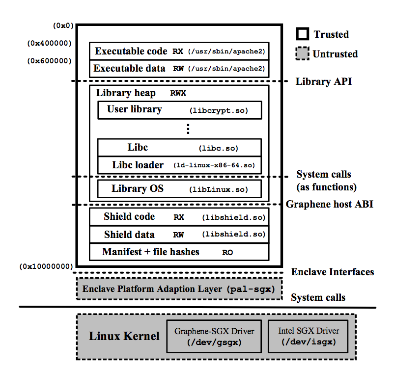
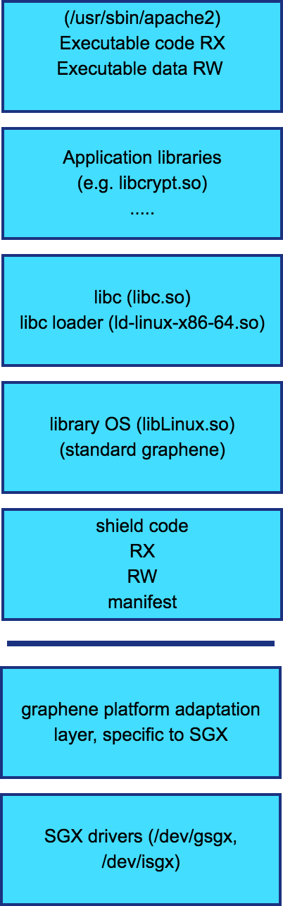
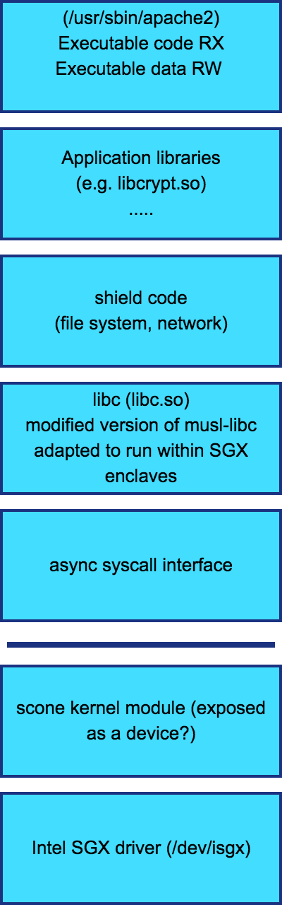
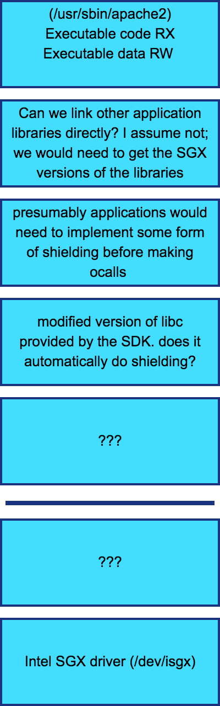

# Secure execution options

After much discussion, we have settled on secure execution using enclaves as
our strategy for all cloud execution. We can use enclaves to convert user raw
data into processed data, as well as to generate user responses to queries and
aggregate them. For aggregation, we will want bi-directional attestation so
that the aggregator enclave can verify that it is getting data from valid user
enclaves, and that the user enclaves can verify that their unmasked data will
go to a valid aggregator that will not leak the information. Note that although
the aggregator can verify that the user enclaves are valid, it cannot verify
that the values provided by the values are correct.

There are multiple options to use enclaves to perform such computation. We need
to understand them and ensure that they work for our use case, in which the
running code is in an interpreted language (python).

## Three main alternatives

The three main options for running code in an enclave appear to be:
1. *Use the SDK directly*: Intel has an SDK to help people write enclave
programs. Programs need to be rewritten to use the SDK.
1. *Use a shim (scone)*: Use a simple libc that is rewritten to run within the enclave.
Existing applications can be recompiled against the modified C library and run
transparently within the enclave.
1. *Using a library OS (graphene)*: Use standard C libraries, but integrate a libraryOS
into the enclave. The libraryOS will make calls to the "host", which will be
translated into syscalls through the host kernel.

## Comparison of the options
Both scone and graphene have architecture diagrams, but I liked the graphene one 
better because I felt that the increased detail made it clearer. Here's the
diagram - Figure 3 from the paper.

In order to have a direct comparison, I tried to draw similar diagrams for the
other two options as well.

| Graphene | Scone | Intel SDK |
|--------- | ----- | --------- |
|  |  |  |

